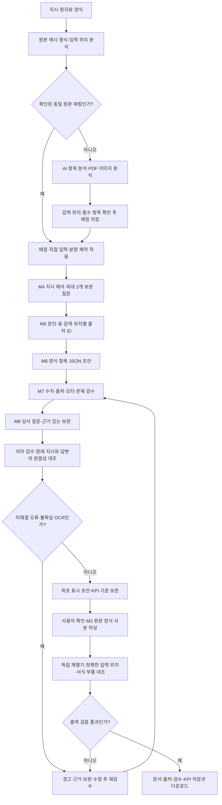

# 문서 표준화 AI AGENT 처리 구조

기업명이나 산업에 종속되지 않고 원본 문서의 입력 위치와 항목 제약을 기준으로 작성함. 새 양식을 받아도 같은 파싱·매핑·검색·작성·검수·저장 경로를 사용함. 다만 원본이 보호되거나 입력 위치가 불확실하면 미지원 이유와 확인할 위치를 표시하며 성공으로 숨기지 않음.

## 작성과 이중 검증

첫 검증은 내용의 정확성과 완결성을 검사함. 수치의 단위·기간·목표/실적·회사 문맥, 출처 원문 인용, 오타·용어·문체, 필수 항목, 원래 지시와 실제 답변을 대조함. 안전한 자동 수정은 한 번으로 제한하며 남은 오류는 표시함. 숫자가 같다는 이유만으로 다른 항목·목표·미래 계획을 실적으로 인정하지 않음.

두 번째 검증은 저장 파일을 독립적으로 다시 열어 검사함. 값의 존재뿐 아니라 원래 입력칸의 정확한 값·주변 안내문·줄바꿈을 대조하고, 수정 대상 밖의 스타일·글꼴·표·병합·수식·차트·그림·테마·관계를 보존했는지 확인함. 명백한 고정 높이 셀 넘침도 검사함. 자동 검증과 실제 문서 프로그램에서의 전체 배치 확인은 별도로 기록함.

초안·근거·원래 지시·답변·양식이 바뀌면 이전 검수와 다운로드 결과를 무효화함. 실제 LLM 의미 검수나 완결성 검수가 실패·누락되면 성공으로 대체하지 않음. 사용자 이름·서명·동의·투표·승인 값은 사용자의 실제 입력을 보존하며 모델이 임의 생성하지 않음.

## 문서 종류와 전문 업무

문서 종류는 보고서·기안, 신청서·제출서류, 계획서·제안서, 공문·안내문, 회의록, 기타 사내외 문서로 구분함. `agent/documents.py`가 문체와 기본 양식을 선택하며, 비보고서의 공문 표현·회의 기록·날짜·직접 입력 항목에 보고서 종결을 강제하지 않음. 기존 보고 유형 3개는 내부 처리 분류로 유지함.

`agent/pipeline.py`의 업무 등록표는 RA·무역/지원사업·기획/금융/일상/품질 검수 모듈과 연결됨. 사용자 선택이나 SHA로 확인한 양식 프로파일에서 업무를 정하고, 같은 업무의 공식 체크리스트·출처와 `prompts/ra.md`, `business.md`, `office.md`를 작성 요청에 전달함. 충돌하는 전문 분야를 동시에 적용하거나 모르는 업무를 일반 업무로 숨기지 않음.

초안·편집·다운로드마다 `agent/ra.py`, `business.py`, `office.py`에서 원문 대조를 다시 실행함. 약품 용량·시험번호, 통화·VAT·지원금/자부담, 연결/별도·회계기간·잠정/확정·%/%p/bp 등은 전문 검사를 적용하며 일반 수치 자동 수정을 사용하지 않음. 전문 초안도 출처·의미·완결성 검사와 저장 후 독립 검사를 모두 통과해야 함.

카탈로그는 대표 서식과 대체 확장자, 빈 양식과 완성 참고 보고서, 서식 개정일과 공고 접수 기간을 구분함. 같은 원본을 다른 업무에서 재사용하면 SHA 고유 수와 검사 작업 수를 별도로 집계함. 원본·직접 입력 필드·필수 첨부·서명·전체 페이지 확인 범위도 프로파일에 기록함.

## 새 양식 학습과 재사용

| 저장하는 정보 | 재사용 방식 |
|---|---|
| 원본 SHA-256·엔진 버전 | 같은 원본인지 확인함. 원본이나 해석 규칙이 바뀌면 다시 분석함 |
| 확인된 항목 ID·XML/셀/도형 위치·PDF 좌표 | 제목·요약·본문과 임의 양식 항목을 정확한 입력 위치에 연결함 |
| 필수 여부·직접 입력·최대 길이·인용 표시 방식 | 누락·입력값 위변조·넘침을 작성 전후에 검사함 |
| 확인 상태·캐시 무결성 | 사용자가 확인하지 않은 AI 제안과 검증된 재사용 매핑을 구분함 |
| 명시 저장한 제한된 용어 선호 | 다음 초안에서 안전한 동의 표현만 반영함 |

매핑 캐시에 개인 값·본문·답변을 저장하지 않음. 이 기능은 양식 구조와 확인한 제약의 학습이며 모델 가중치를 재훈련하는 기능은 아님. 파일을 변경하면 이전 원본용 매핑을 자동 적용하지 않음. 최초 보는 PDF는 이미지로 위치를 분석하고 사용자가 좌표를 확인함. 작성 근거의 OCR 결과도 원본과 대조해야 최종 출력함.

새 PDF 양식의 분석은 10쪽 제한 없이 전체 페이지를 선택할 수 있음. 페이지 렌더링은 순서대로 수행하고 이미지 모델 요청만 최대 4개로 병렬 처리하여 PDFium의 동시 렌더를 피함. 결과의 `image_analysis`에 분석한 쪽·남은 쪽·전체 페이지 분석 여부를 저장함. 이는 입력칸 전수 발견이나 제출 적합성 인증을 뜻하지 않음. 어느 페이지라도 요청/응답 검사가 실패하면 확인된 부분 프로파일을 저장하지 않음.

입력 매핑은 최대 64칸씩 요청하고 각 배치의 ID 및 전체 필드 집합·직접 입력 보호·반복 항목 제약을 대조함. PDF 위치 메타데이터와 원본 행/도형 문맥을 전달하며, XML 부품과 XLSX 공유 문자열은 한 번 읽어 같은 요청 안에서 재사용함. 합성 200항목 DOCX의 문맥 추출 중앙값은 0.1348초에서 0.0088초로 감소함. `outputs/template-learning-context-benchmark.json`에 기록하며 실제 모델 응답 시간이나 사용자 작성 KPI로 환산하지 않음.

## 병렬 처리와 시간 단축

- 공개 자료 수집은 공식 도메인·관찰한 링크·제한된 탐색 범위를 사용하고 최대 4개 작업으로 병렬 처리함. 개별 실패가 전체 수집을 멈추지 않으며 해시로 중복을 구분함.
- 호환 코퍼스는 최대 4개 독립 프로세스로 파일별 시간 제한을 적용함. 다운받은 원본·파싱·실제 기입·네이티브 렌더 확인 수를 따로 집계함.
- 스캔 PDF 렌더링은 순서를 보존하고, 이미지 모델 요청은 최대 4개로 병렬 처리함. 불확실 페이지를 성공으로 바꾸지 않음.
- 같은 원자료의 파싱/OCR 결과는 파일 해시·파서·모델·프롬프트 기준의 제한된 캐시로 재사용함. 임베딩은 배치 처리하며 검색 저장소는 나중에 벡터 DB로 바꿀 수 있음.
- 단계 사이에 의존성이 있는 초안·검수·상사 보완·최종 검수는 순서를 지킴. 모든 외부 LLM 요청은 `llm/client.py`로 모아 재시도·시간 제한·사용량 기록을 적용함.

## KPI와 평가

가장 중요한 지표는 처음 사용자에게 표시한 AI 초안 대비 최종본의 수정 비율임. 입력 보완·재생성·반려에도 기준 초안을 덮어쓰지 않음. 항목별 문자 편집 거리를 합산하며 긴 변경에서 근사 계산을 썼는지 표시함. 초안→확정 시간과 실제 사용자가 기록한 반려·재작업 횟수를 함께 저장함. AI 내부 보완을 인간 반려로 계산하지 않음.

생성·AI 검수 시간은 별도로 측정함. `evals.run`은 15개 품질 사례의 프롬프트 변경 회귀를 검사하고, `evals.domains`는 전문 업무 규칙 24개와 선택적인 실제 모델 작성 12개를 구분함. `evals.compatibility`는 파일 형식별 구조·기입·보존을 검사하며, `evals.work_kpis`는 실제 확정 기록만 집계함. 실사용 기록이 없으면 수정 비율을 0%로 표시하지 않음.

## 경계와 남은 검증

공개 원본의 확보와 비공개 사내 양식 전체 호환은 별개임. 순위 목록이나 기관 registry는 전체 서식 확보 증명이 아님. HWP 5는 읽기를 지원하며 작성에는 HWPX 사본이 필요함. 보호 문서의 허용된 양식 입력칸만 정상 작성하고 암호·DRM·서명 보호를 제거하지 않음. 모든 법정서식 현행성·전자 제출·인증·서명, 모든 프로그램의 장문 배치, 실제 모델 정확도와 사용자 수정 부담은 별도 평가 대상임.
