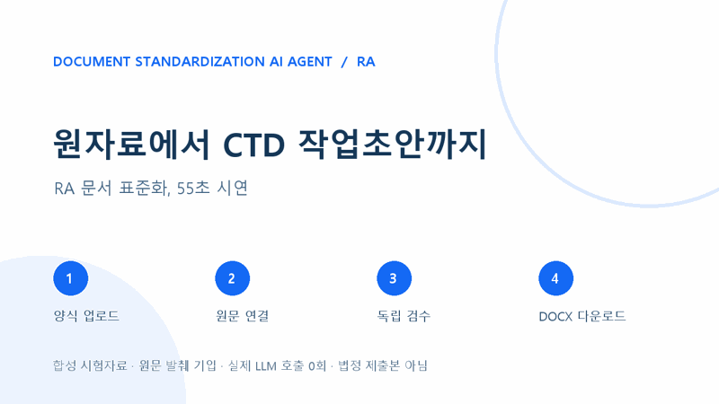

# RA 문서 표준화: CTD 작업초안 55초 데모

**[영상 보기 (MP4, 55초)](ra_ctd_short_demo.mp4)** · [GitHub 미리보기 GIF](ra_ctd_preview.gif) · [실제 생성 결과 ZIP](CTD_demo_output.zip) · [Word 렌더 화면](capture/output_page.png) · [녹화·검수 기록](provenance.json)

실제 RA 작업실 화면에서 합성 `예시정`의 CTD 예제 DOCX 양식과 합성 배치 처방·배치 분석·안정성 원자료 3개를 업로드함. 작성할 `3.2.P.3.2`, `3.2.P.5.4`, `3.2.P.8.3` 절을 선택하고 원문 후보 3/3절의 파일·출처 ID·문자 위치를 확인한 뒤, 검토용 DOCX와 별도 출처 기록을 다운로드함. ZIP의 저장 후 입력 위치 검수 결과는 `passed`임.

이 영상은 **실제 작업실 UI와 격리된 FastAPI 백엔드**를 사용한 합성 자료 시연임. 규칙에 따라 확인된 원문을 발췌해 기입했으며 **LLM 호출은 0회**임. 실제 품목허가·제조·시험 사실, 제출 적합성, 사람의 수정률 또는 모델 작성 품질을 증명하지 않음. 개인정보·회사 기밀·API 키는 사용하지 않았음. 생성한 문서는 담당자 검토용 작업초안이며 법정 제출본이 아님.

마지막 화면은 생성 DOCX를 Microsoft Word에서 읽기 전용으로 열고 PDF로 내보낸 뒤 렌더링한 한 페이지임. [렌더 화면 연결 기록](capture/output_page.json)에 사용한 결과 ZIP과 이미지의 SHA-256을 보관함. 확인한 이 페이지에서는 입력 위치와 글자 잘림 문제가 보이지 않았음. 다른 양식이나 뷰어까지 검증했다는 뜻은 아님.

재현: 프로젝트 Python 환경에서 `python -m docs.demo_ra.record`로 비공개 `.runtime/demo_ra_capture`에 실제 UI 캡처와 검수한 ZIP을 만든 후 `python -m docs.demo_ra.render`를 실행함. 녹화 입력은 [예제 CTD 양식](../../samples/ctd_demo_template.docx), [배치 처방](../../samples/ctd_demo_batch_formula.txt), [배치 분석](../../samples/ctd_demo_batch_analysis.txt), [안정성](../../samples/ctd_demo_stability.txt) 파일임. Windows Edge, Playwright, Pillow와 영상 인코딩용 `imageio-ffmpeg`가 필요함.
