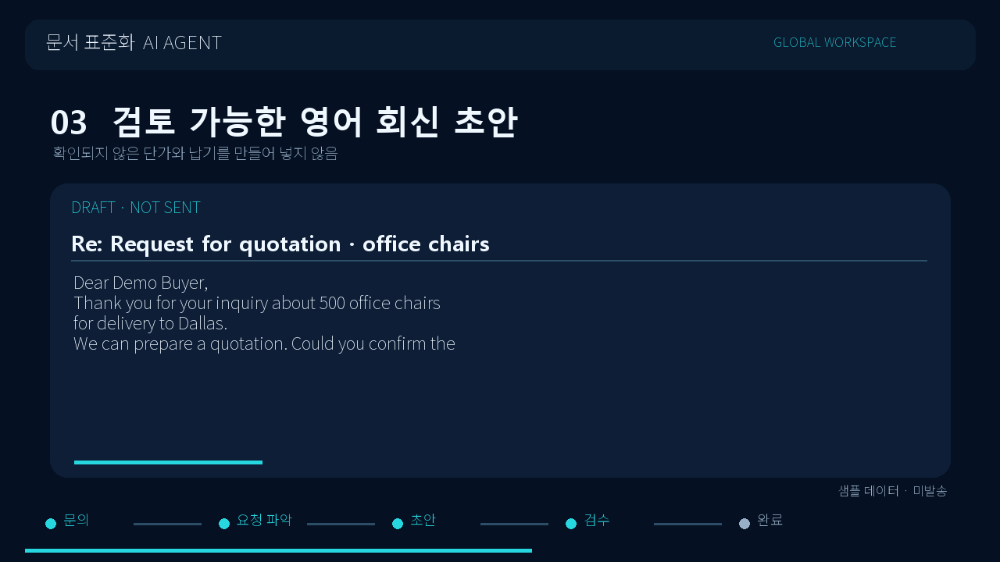

# 해외영업 이메일 회신 데모

[30초 영상 보기·다운로드](buyer_email_demo.mp4) · [데모 입력 이메일](sample_buyer_email.eml) · [출력 예시](sample_reply_draft.txt)

공개된 [미국 연방 법원 견적 요청 예시](https://www.arwd.uscourts.gov/sites/arwd/files/Request%20for%20Quote%20-%20FSM%20Offices%2007-01-21.pdf)에서 **품목·수량·납기·배송 조건을 묻는 구조**만 참고하고, 문장·회사·수신인·장소는 시연용으로 새로 작성함. 원문의 기관명, 실제 담당자, 연락처, 날짜, 거래 조건은 사용하지 않음. 영상 속 바이어 메일과 결과물은 가상 데이터임.

영상은 `받은 문의 → 요청 3건 파악 → 영어 회신 초안 → 근거·누락 검토 → 담당자 확인 대기`를 보여주는 **제품 흐름 시뮬레이션**임. 실제 Gemini 호출, Gmail 수신·발송, 처리 시간, 사람 수정률을 촬영하거나 입증한 영상이 아님. 예시 결과는 가격·납기를 만들지 않고 담당자가 확인할 항목으로 남김. 실제 사용에는 본인의 작업공간·모델 연결과 발송 전 검토가 필요함.

영상 재생이 안 되면 MP4 파일을 내려받아 일반 동영상 플레이어에서 열 수 있음. 원본 생성 코드는 [render.py](render.py)에 있으며, Pillow와 `imageio-ffmpeg` 설치 후 `python docs/demo_sales/render.py`로 재생성 가능함.
