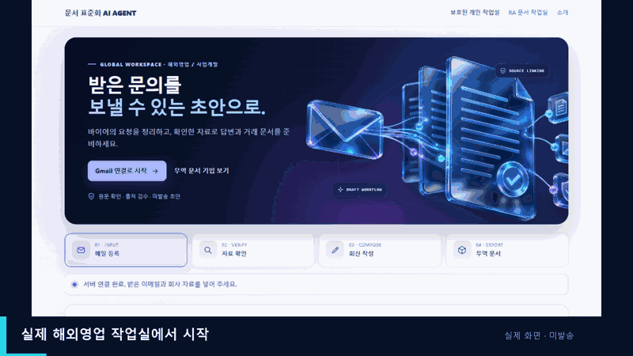

# 해외영업 이메일 회신: 실제 작업실·Gemini 데모

**[1분 22초 전체 영상 보기·다운로드](buyer_email_live_demo.mp4)** · [실제 모델 출력 초안](sample_live_reply_draft.txt) · [가상 바이어 메일](sample_buyer_email.eml) · [가상 회사 원자료](sample_company_facts.txt)

위 GIF는 GitHub에서 바로 보이는 **16초 미리보기**임. 전체 영상은 MP4 링크를 열어 `Download raw file`을 눌러 재생함.

전체 영상은 실제 `share_site/dist/sales.html` 작업실에서 가상 바이어 메일을 입력하고 가상 TXT 회사 원자료를 첨부한 뒤, **로컬 `.env`에 저장된 Gemini API 키로 실제 Gemini 3.5 Flash 작성을 요청한 성공 사례**임. 실제 FastAPI 작업 API가 원자료를 읽고 요청 분석·출처 연결·독립 검수를 거쳐 영문 초안을 화면에 표시함. API 키는 화면·영상·저장소에 넣지 않았으며 녹화 화면의 키 입력 칸은 가렸음. 영상에는 단계별 실제 화면 캡처와 설명 자막을 사용했고, 처리 시간을 실시간 속도로 나타낸 영상은 아님.

바이어 메일의 구조는 공개된 [미국 연방 법원 견적 요청 예시](https://www.arwd.uscourts.gov/sites/arwd/files/Request%20for%20Quote%20-%20FSM%20Offices%2007-01-21.pdf)에서 **품목·수량·납기·배송 조건을 묻는 구조**만 참고하여 문장과 거래 내용을 새로 작성함. 회사 원자료의 제품·가격·납기·인도조건은 모두 시연용 가상 값임. 실제 거래 제안이나 발송 메일이 아니며, Gmail 수신·발송, 실사용 처리 시간과 사용자 수정률을 입증하는 영상이 아님. 수신인·거래조건·서명은 담당자가 확인해야 함.

재현: Python 3.11 환경에 프로젝트 의존성과 Playwright를 설치한 후 Windows Edge에서 `python -m docs.demo_sales.record_ui --live`를 실행함. 이 명령은 `.env`의 `GEMINI_API_KEY`로 새 실제 모델 응답을 받고 `.runtime/demo_sales_frames`에 비공개 원본 캡처를 보관함. `python -m docs.demo_sales.render_live`는 키 입력 영역을 가린 화면을 `capture/`에 저장하고 MP4/GIF를 생성함. 영상 인코딩에는 Pillow와 `imageio-ffmpeg`가 필요함. **녹화 결과를 재생성할 때마다 모델 문장과 검수 결과가 달라질 수 있음.**

이전 [30초 제품 흐름 시뮬레이션](buyer_email_demo.mp4)은 실제 모델 결과가 아닌 예시 화면임. [이전 예시 출력](sample_reply_draft.txt)과 [생성 코드](render.py)를 별도로 보관함.
